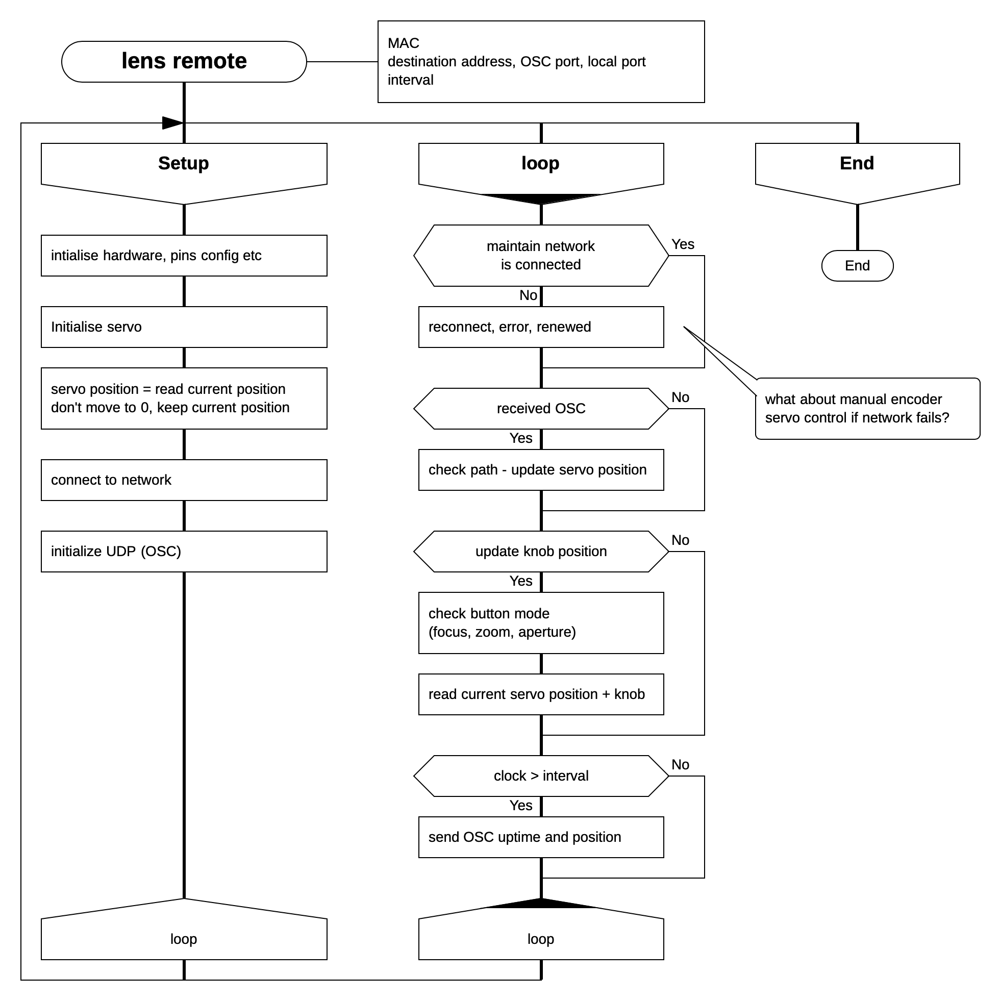

# Remote lens control with mini servo and OSC

## About The project

This project solves a problem how to remotly control non-motorized lens. Three camera lenses: focus, aperture and zoom rings are moved by mini servos. The servos are controlled by an arduino with ethernet module. OSC protocol is used for communication over ethernet with the controller. It sends uptime, current servo position and receives servo position.

## Concept

## Hardware
* arduino nano
* ethernet ENC28J60 module
* mini servo 180deg
* rotary encoder

## Built With
* [Drakon](http://drakon-editor.sourceforge.net) - visual language for flowcahrts
* [Atom](https://atom.io) - An amazing text editor
* [PlatformIO](https://platformio.org) - An ecosystem for embedded development

## License
This project is licensed under [MIT license](http://opensource.org/licenses/mit-license.php)

## Project status
- Prototype under development.
- Firmware under development.
