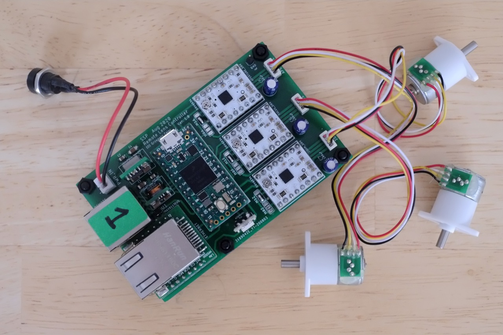

<a href="http://gz.technology" target="_blank"></a>

# Remote lens control with mini servo and OSC

## About The Project

This project solves a problem of remote controling non-motorized lens. Three camera lens rings: focus, aperture and zoom rings are moved by mini stepper motors. The motors are controlled by a teensy controler with ethernet module. OSC protocol is used for communication with the controller over ethernet cat5. The controler receives motor position and sends back feedback OSC messages: uptime and current stepper position.
Various existing applications can be used for remote control i.e Isadora, TouchOSC, Qlab, MaxMSP etc.

## Hardware
* teensy 4.0
* ethernet wiz5500 module
* 3x DRV8823 stepper driver
* 3x (focus, zoom, aperture) mini stepper motors GM1527-10
* [rotary encoder with RGB led from Saimon](https://github.com/Fattoresaimon/I2CEncoderV2.1) - Hardware V2.1

#### Construction



All comopnents are soldered on custom designed PCB. There are few SMD capacitors, MAX811 reset IC, teensy 4.0 and DRV 8823 boards.

## Built With
* [Drakon](http://drakon-editor.sourceforge.net) - visual language for flowcahrts
* [Atom](https://atom.io) - An amazing text editor
* [PlatformIO](https://platformio.org) - An ecosystem for embedded development

## Libraries versions

State of 05.03.2025 after working and fixing "jamming" issue, FW ver 3.4.7

```bash
Dependency Graph
|-- Ethernet @ 2.0.2
|-- EthernetBonjour @ 1.0.0
|-- AccelStepper @ 1.64.0
|-- SPI @ 1.0.0+sha.52f8402
|-- DuPPa Library @ 1.2.0+sha.ba86fe9
|-- Adafruit NeoPixel @ 1.1.7
|-- Bounce2 @ 2.55
|-- EEPROM @ 2.0
|-- OSC
|-- Wire @ 1.0
```

## License
This project is licensed under [MIT license](http://opensource.org/licenses/mit-license.php)

## Project status
- Hardware V1.0 finished and working.
- Firmware completed, tested, working.